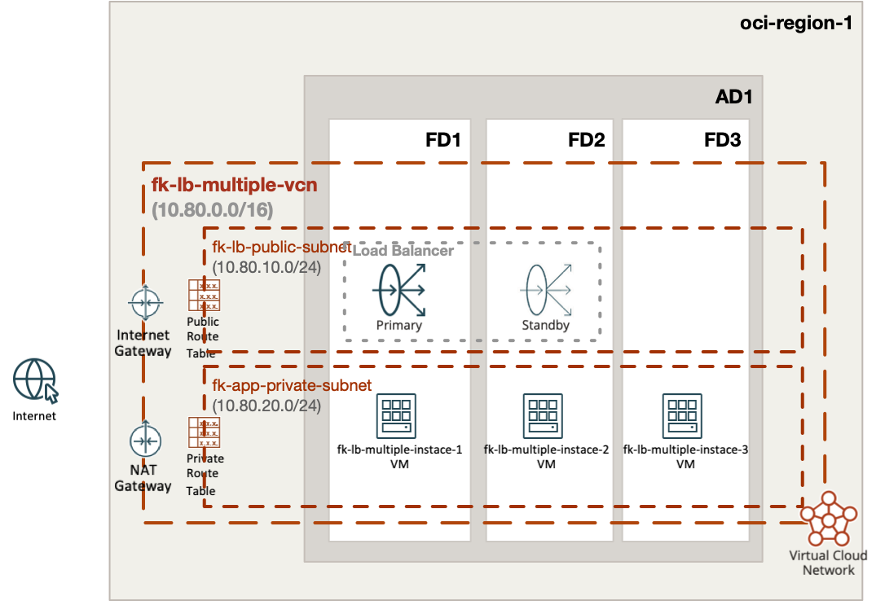
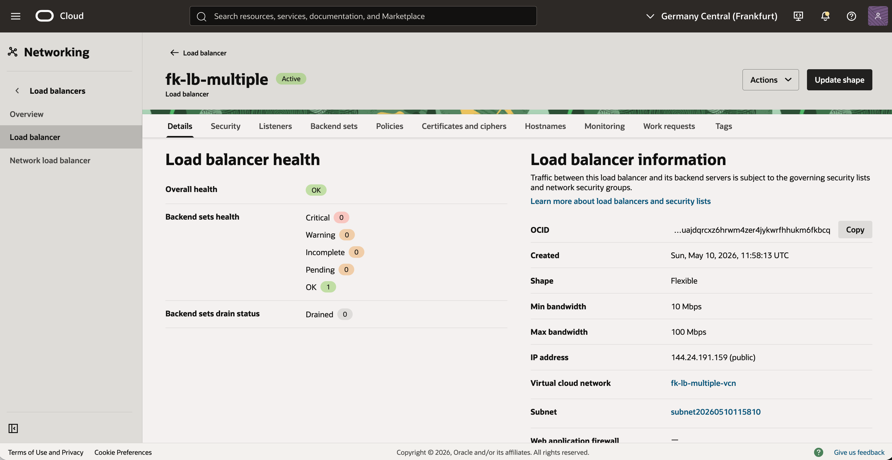
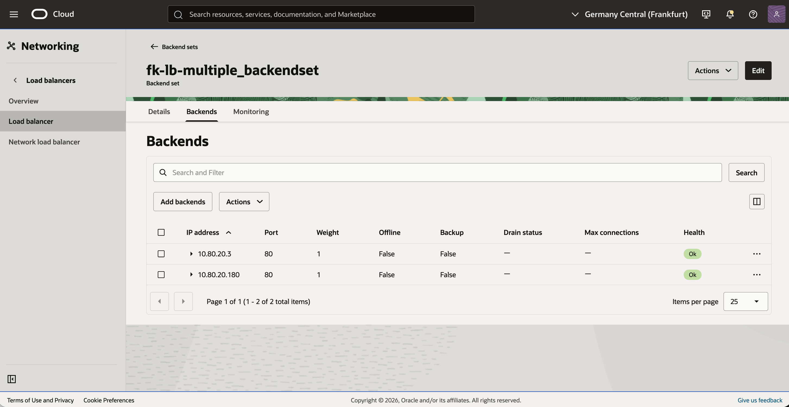
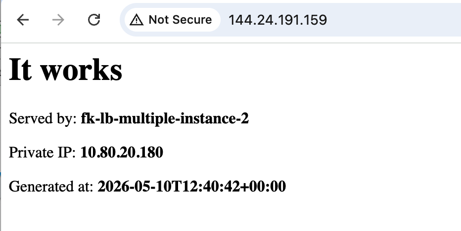

# Example 01: Public OCI Load Balancer With Multiple Compute Instances

In this example, we deploy a **public Oracle Cloud Infrastructure (OCI) Load Balancer**
in front of **multiple regular compute instances** created with `terraform-oci-fk-compute`.
The number of backend instances is controlled by the `instance_count` variable,
so this example is a simple starting point for `2+` application nodes behind one load balancer.

This setup combines:
- `terraform-oci-fk-vcn` for networking
- `terraform-oci-fk-loadbalancer` for the public load balancer
- `terraform-oci-fk-compute` for private backend instances

---

## 🧭 Architecture Overview



This deployment creates:
- A dedicated VCN with one **public subnet** for the load balancer
- One **private subnet** for the application instances
- One **public OCI Load Balancer** listening on port `80`
- `instance_count` regular compute instances in the private subnet
- One backend set populated dynamically from the private IPs of all created instances
- A bootstrap `cloud-init` that starts a simple built-in HTTP service on every backend instance

Traffic flow:
- Clients connect to the public IP of the OCI Load Balancer
- The load balancer forwards HTTP traffic to private backend instances on port `80`
- Backend instances remain private and are not exposed directly to the internet

---

## Deployment Steps

Initialize and apply the Terraform/OpenTofu configuration:

```bash
tofu init
tofu plan
tofu apply
```

If you prefer Terraform:

```bash
terraform init
terraform plan
terraform apply
```

To scale the number of backend instances, set `instance_count` to `2` or more,
for example in `terraform.tfvars`:

```hcl
instance_count = 3
```

---

## Outputs

After a successful deployment, the example returns:
- `load_balancer_id`
- `load_balancer_public_ips`
- `instance_private_ips`

These outputs let you:
- identify the created OCI Load Balancer
- test the public frontend IP
- verify which backend private IPs were attached to the backend set

When you open the load balancer public IP in a browser,
the backend page shows the responding hostname and private IP,
which makes traffic distribution easy to verify.

---

## OCI Console And Runtime Verification

### Load Balancer Status



This view confirms that the public OCI Load Balancer is deployed
and exposed through a public frontend IP.

---

### Backend Health



This view shows the backend set with multiple private backend instances
registered and reported as healthy by the OCI Load Balancer health checker.

---

### HTTP Access Through The Load Balancer



This runtime verification confirms that:
- the public load balancer is reachable from the internet
- traffic is forwarded to a healthy private backend instance
- the backend response includes the hostname and private IP of the serving node

Refreshing the page should show responses from different backend instances
as the load balancer distributes traffic across the backend set.

---

## Notes

This example uses:
- a public subnet for the load balancer
- a private subnet for the application instances
- Oracle Linux 9 images for faster and more predictable bootstrap behavior
- static IP-based backend registration in the load balancer module
- cloud-init bootstrap to publish a simple HTML page on port `80`

Because the compute layer is instantiated with `count`,
each created module instance contributes one backend to the load balancer:

```hcl
backends = {
  for index, instance in module.compute :
  "app${index + 1}" => {
    ip_address = instance.instance_private_ip
    port       = 80
  }
}
```

This makes the example easy to scale without moving to an OCI instance pool yet.
It also makes the demo immediately testable after `apply`,
without any manual package installation on the instances.

---

## Cleanup

To remove all resources created by this example:

```bash
tofu destroy
```

Or with Terraform:

```bash
terraform destroy
```

---

## Summary

This example demonstrates:
- how to deploy a **public OCI Load Balancer**
- how to create `2+` backend instances with `count`
- how to attach multiple private instance IPs to one backend set
- how to keep backend instances private while exposing only the load balancer

---

## License

Licensed under the **Universal Permissive License (UPL), Version 1.0**.
See [LICENSE](../../LICENSE) for more details.

---

© 2026 [FoggyKitchen.com](https://foggykitchen.com) - Cloud. Code. Clarity.
