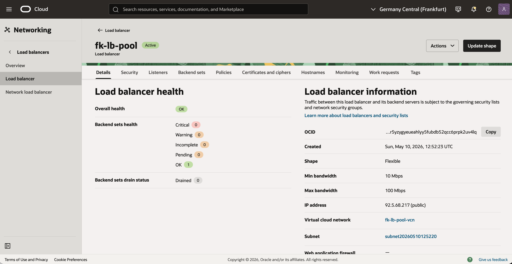
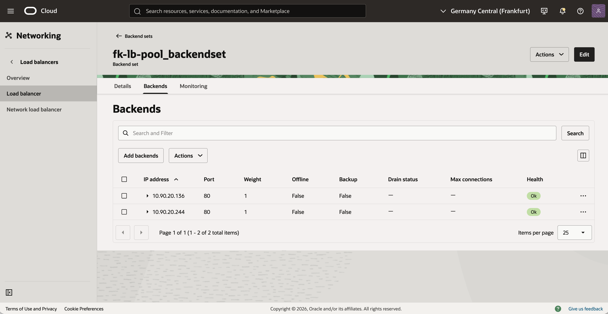
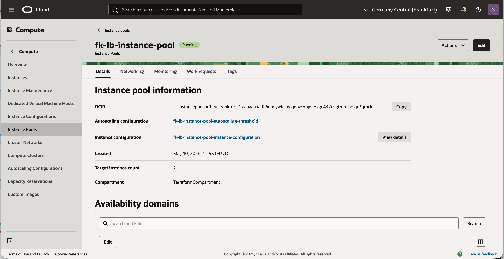
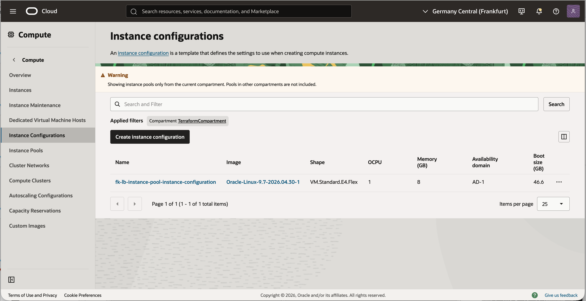
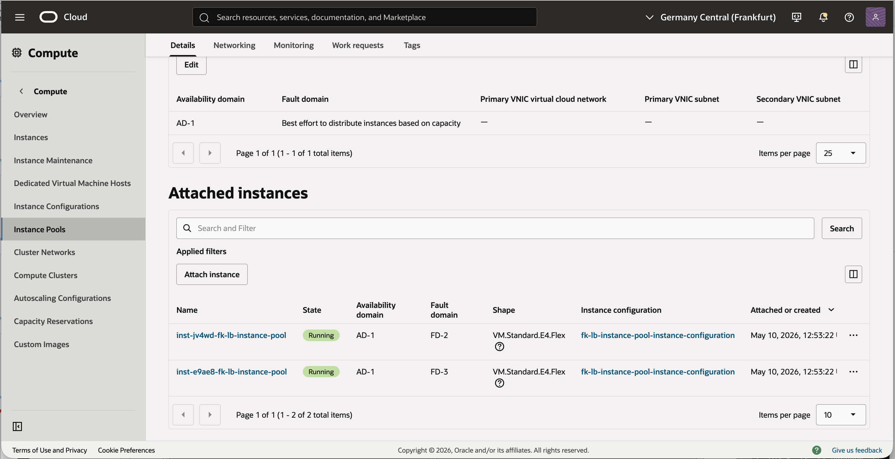
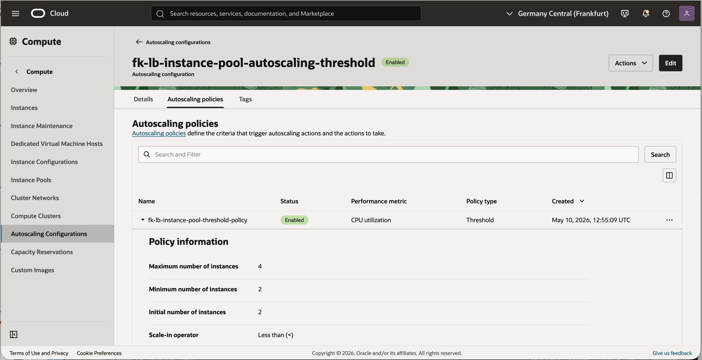
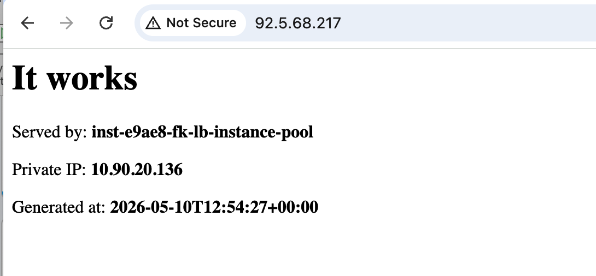

# Example 02: Public OCI Load Balancer With Instance Pool Backends

In this example, we deploy a **public Oracle Cloud Infrastructure (OCI) Load Balancer**
in front of an **OCI instance pool** created with `terraform-oci-fk-compute`.
Unlike Example 01, where individual instances are attached as static backends,
this scenario demonstrates the OCI-native pattern where the compute layer manages
the load balancer attachment for the pool.

This setup combines:
- `terraform-oci-fk-vcn` for networking
- `terraform-oci-fk-loadbalancer` for the public load balancer
- `terraform-oci-fk-compute` for the backend instance pool and autoscaling

---

## Architecture Overview

This deployment creates:
- A dedicated VCN with one **public subnet** for the load balancer
- One **private subnet** for the application instances
- One **public OCI Load Balancer** listening on port `80`
- One **instance pool** attached to the load balancer backend set
- Autoscaling configuration with a minimum of `2` and maximum of `4` instances
- A bootstrap `cloud-init` that starts a simple built-in HTTP service on every pool instance

Traffic flow:
- Clients connect to the public IP of the OCI Load Balancer
- The load balancer forwards HTTP traffic to healthy pool instances on port `80`
- Instance pool members remain private and are not exposed directly to the internet

---

## Deployment Steps

Initialize and apply the Terraform/OpenTofu configuration:

```bash
tofu init
tofu plan
tofu apply
```

If you prefer Terraform:

```bash
terraform init
terraform plan
terraform apply
```

---

## Outputs

After a successful deployment, the example returns:
- `load_balancer_id`
- `load_balancer_public_ips`
- `instance_pool_id`
- `autoscaling_configuration_id`

These outputs let you:
- identify the created OCI Load Balancer
- test the public frontend IP
- confirm which instance pool was attached
- verify that autoscaling configuration was created

When you open the load balancer public IP in a browser,
the backend page shows the responding hostname and private IP,
which makes traffic distribution across pool members easy to verify.

---

## OCI Console And Runtime Verification

### Load Balancer Status



This view confirms that the public OCI Load Balancer is deployed
and exposed through a public frontend IP.

---

### Backend Health



This view shows the load balancer backend health for the instance pool members
and confirms that the attached backends are serving traffic correctly.

---

### Instance Pool Status



This view confirms that the OCI instance pool is created and running
as the backend compute layer for the load balancer.

---

### Instance Configuration



This view shows the instance configuration used by the pool,
including the template from which backend instances are launched.

---

### Attached Pool Instances



This view confirms that multiple compute instances are attached to the pool
and managed as a single backend capacity group.

---

### Autoscaling Configuration



This view confirms that the autoscaling configuration is created
for the instance pool backend tier and complements the load balancer integration.

---

### HTTP Access Through The Load Balancer



This runtime verification confirms that:
- the public load balancer is reachable from the internet
- traffic is forwarded to a healthy instance pool member
- the backend response includes the hostname and private IP of the serving node

Refreshing the page should show responses from different pool members
as the load balancer distributes traffic across the attached instances.

---

## Notes

This example uses:
- a public subnet for the load balancer
- a private subnet for the application instances
- Oracle Linux 9 images for faster and more predictable bootstrap behavior
- OCI instance pool attachment via `lb_attachment`
- threshold-based autoscaling
- cloud-init bootstrap to publish a simple HTML page on port `80`

Because this is an instance pool deployment,
backend registration is managed by the compute layer instead of a static `backends` map.
That makes this example a better foundation for elastic capacity than Example 01.

---

## Cleanup

To remove all resources created by this example:

```bash
tofu destroy
```

Or with Terraform:

```bash
terraform destroy
```

---

## Summary

This example demonstrates:
- how to deploy a **public OCI Load Balancer**
- how to attach an **OCI instance pool** to the load balancer
- how to bootstrap each backend instance with a simple HTTP service using cloud-init
- how to enable threshold-based autoscaling for the backend tier

---

## License

Licensed under the **Universal Permissive License (UPL), Version 1.0**.
See [LICENSE](../../LICENSE) for more details.
